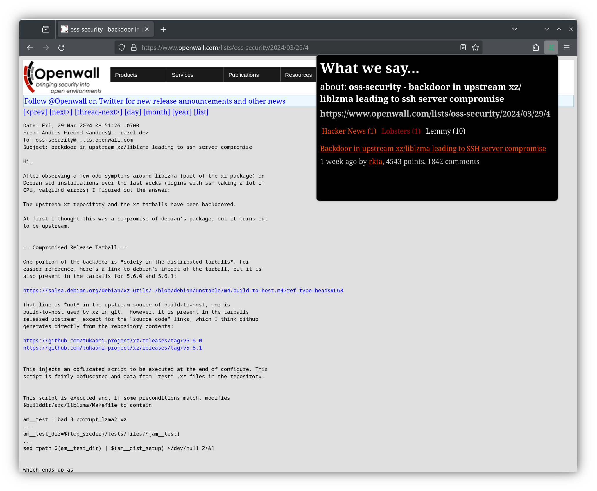

= What We Say… about this page?

////
https://addons.mozilla.org/en-US/firefox/addon/whatwesay/[image:https://img.shields.io/amo/users/whatwesay?style=for-the-badge&logo=firefox&label=Firefox%20Add-on[Firefox Add-on]]
https://chromewebstore.google.com/detail/what-we-say/ldpiodgcecoajgcmbkaionbkaeolajhg[image:https://img.shields.io/chrome-web-store/users/ldpiodgcecoajgcmbkaionbkaeolajhg?style=for-the-badge&logo=google-chrome&label=Chrome%20extension[Chrome Web Store]]
////

A browser extension to list posts about the currently opened page on various
discussion sites.

Install for
https://addons.mozilla.org/en-US/firefox/addon/whatwesay/[Firefox]
or
https://chromewebstore.google.com/detail/what-we-say/ldpiodgcecoajgcmbkaionbkaeolajhg[Chrome].

.Supported sites
- https://news.ycombinator.com[Hacker News]
- https://lobste.rs[Lobsters]
- https://join-lemmy.org[Lemmy]

The ability to enable/disable individual sites and change which Lemmy instace to
search is planned.

== Permissions, data usage and third-party service usage

.Permissions
- activeTab: to get URL and title of the current active tab
- Host permission on https://lobste.rs/: to retrieve information of its posts
- Host permission on https://html.duckduckgo.com/: to search Lobsters posts

When the action button is clicked, the URL or title of the current tab you are
on is sent to each of the supported sites to search for related posts.
Specially, searches for Lobsters is sent to and done through
https://duckduckgo.com[DuckDuckGo]. By using this extension you agree to their
respective terms of use and other legal terms.

No other data is sent to anyone.

== Acknowledgements

Thanks to the inspiration,
https://github.com/pinoceniccola/what-hn-says-webext[What HN Says].

The https://healthicons.org/icon/filled/people/group_discussion_meetingx3[icon]
of this extension is from https://healthicons.org[Health Icons], licensed under
http://creativecommons.org/publicdomain/zero/1.0/[CC-0]. Its fill color is
#31AA74, taken from https://meodai.github.io/color-names/[Color-Names].
